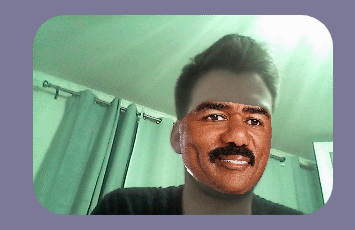

<h1 align="center">Wasm Face Recognition</h1>

    
    

    </img>

Identify and manipulate faces in a web browser.

The facial recognition software uses a combination of OpenCV, DLib, and some
custom C++ code all compiled into web assembly.  The front end utilizes
Javascript's new found love for primitive data types to pass pointers to and
from native machine code to modify images.

Our sister project [Celebraphone](https://gitlab.com/mattmatters/celebraphone) uses this for p2p video chatting in a browser. You can find that project [here](https://celebraphone.io).

The project also uses a base image for compilation that you can find the source for [here](https://github.com/mattmatters/docker-emscripten-opencv-dlib) and pull from [here](https://hub.docker.com/r/superpolkadance/emscripten-opencv-dlib/).

## Running locally

To run locally, make sure you have docker up and type `docker-compose up --build`.

## Thank You Everyone!

This project was made possible by some of the people below.

